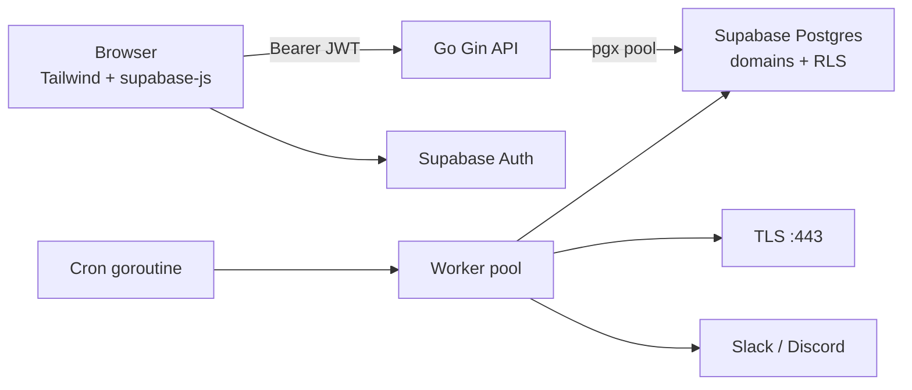

# SSL Expiry Checker

Web dashboard for monitoring TLS certificate expiry. **Go (Gin)** backend, **Supabase** (Postgres + Auth), **Tailwind** + plain **JavaScript** frontend with **Supabase JS** for sign-in. Includes a **worker pool** for concurrent checks, a **12-hour** (configurable) background scan, and optional **Slack** or **Discord** webhooks.

_Add a screenshot of the dashboard here after your first deploy._

## Architecture



- The browser authenticates with Supabase and sends the access token as `Authorization: Bearer …`.
- The API verifies JWTs with **HS256** and `SUPABASE_JWT_SECRET`, and scopes every query by `user_id`.
- **RLS** on `public.domains` restricts direct PostgREST access to the owning user (`(select auth.uid())` pattern for performance).

## Prerequisites

- Go **1.23+** (see `go.mod`)
- A **Supabase** project with Auth enabled
- Database connection string (pooler recommended), **JWT secret**, and **publishable** API key from the Supabase dashboard

## Supabase setup

1. Create a project (or use an existing one).
2. Run the SQL in [`supabase/migrations/0001_init_domains.sql`](supabase/migrations/0001_init_domains.sql) in the SQL editor (or apply via Supabase migrations / MCP). This creates `public.domains`, indexes, and RLS policies.

**Optional project created during development:** ref `ubcrrnpvkbgeltonjmpe` — replace with your own project ref in `.env`.

## Configuration

Copy [`.env.example`](.env.example) to `.env` and fill in:

| Variable | Description |
|----------|-------------|
| `SUPABASE_DB_URL` | Postgres URI (use **Session pooler** on port **6543** for server apps when recommended by Supabase). |
| `SUPABASE_PROJECT_URL` | Project URL, e.g. `https://<ref>.supabase.co`. |
| `SUPABASE_PUBLISHABLE_KEY` | Publishable or legacy anon key (safe for the browser). |
| `SUPABASE_JWT_SECRET` | **Settings → API → JWT Secret** — used only on the server to verify tokens. **Never** expose the `service_role` key in the frontend. |
| `WEBHOOK_URL` | Optional. Slack (`hooks.slack.com`) or Discord (`discord.com/api/webhooks/...`) URL. |
| `EXPIRY_THRESHOLD_DAYS` | Days before expiry to mark a cert as `expiring` (yellow). Default `15`. |
| `SCAN_INTERVAL_HOURS` | Full-database scan interval. Default `12`. |
| `WORKER_COUNT` | Concurrent TLS workers. Default `10`. |
| `PORT` | HTTP port. Default `8080`. |

## Local development

```bash
cp .env.example .env
# edit .env

go mod tidy
go run ./cmd/server
```

Open `http://localhost:8080`. Sign up or sign in, add hostnames, then **Scan all** or **Rescan** per row.

### Tests

```bash
go vet ./...
go test ./...
```

## Docker

```bash
docker build -t ssl-expire-checker .
docker run --rm -p 8080:8080 --env-file .env ssl-expire-checker
```

Or with Compose:

```bash
docker compose up --build
```

The image runs as **nonroot** and expects `web/` next to the binary at `/app`.

## HTTP API

All `/api/*` routes except `GET /api/health` and `GET /api/config` require `Authorization: Bearer <supabase_access_token>`.

| Method | Path | Description |
|--------|------|-------------|
| `GET` | `/api/health` | Liveness. |
| `GET` | `/api/config` | `{ supabaseUrl, publishableKey, expiryThreshold }` for the SPA. |
| `GET` | `/api/domains` | List current user’s domains. |
| `POST` | `/api/domains` | Body: `{ "url": "example.com" }`. Idempotent per user+url. |
| `DELETE` | `/api/domains/:id` | Delete if owned. |
| `POST` | `/api/domains/:id/scan` | Scan one domain and update DB. |
| `POST` | `/api/scan-all` | Scan all domains for the current user. |

Background job: on startup and every `SCAN_INTERVAL_HOURS`, the server scans **all** rows in `domains` (DB role bypasses RLS) and sends one webhook digest for rows in `expiring` or `expired` state.

## Troubleshooting

| Symptom | Likely cause |
|---------|----------------|
| `401` on API calls | Missing/expired token; sign in again. |
| `invalid or expired token` | Wrong `SUPABASE_JWT_SECRET` or clock skew. |
| DB connection errors | Incorrect `SUPABASE_DB_URL`, firewall, or use **IPv4** pooler host if IPv6 is blocked. |
| TLS dial timeout | Host unreachable, wrong port (scanner uses **443**), or firewall. |
| Sign-up succeeds but cannot sign in | Supabase **email confirmation** enabled — confirm email or disable confirmation for dev in Auth settings. |

## Security notes

- Use the **publishable** key in the browser only. Do **not** embed `service_role` or the JWT secret in client code.
- RLS policies use `auth.uid()` wrapped as `(select auth.uid())` per Supabase performance guidance.
- `user_metadata` must not be used for authorization (see Supabase security docs); this app uses `sub` and server-side `user_id` filters.

## License

MIT (or your organization’s default — adjust as needed.)
